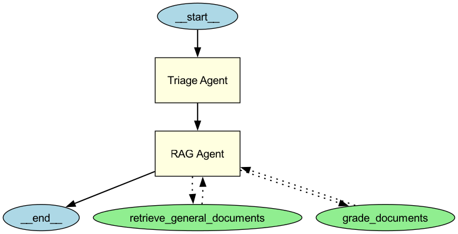

# RAG Agent UCY Project

This project implements a Retrieval-Augmented Generation (RAG) agent designed to answer questions based on a corpus of documents related to UCY (University of Cyprus). It uses Langchain, FAISS for vector storage, Ollama embeddings, and OpenAI models for tasks like document relevance grading. The project is managed using `uv` for package and virtual environment management.

## Project Structure

```
rag-agent-ucy
├── .DS_Store           # macOS specific file
├── .python-version     # Specifies Python version (likely for pyenv)
├── Makefile            # Defines common commands (sync, serve)
├── README.md           # This file
├── data/               # Source data for the vector database
│   ├── course_list.json
│   ├── forms.json
│   └── scraped_urls.json
├── faiss_index/        # Directory where the FAISS index is saved (created by warmup.ipynb)
├── main.py             # Main application entry point
├── pyproject.toml      # Project metadata and dependencies for uv
├── src/                # Source code for the agent
│   ├── agent_config.py # Agent configuration settings
│   ├── context_model.py# Pydantic model for agent state/context
│   ├── prompts.py        # LLM prompts used by the agent
│   └── tools.py        # Defines agent tools (retrieval, grading)
├── uv.lock             # Lock file for reproducible dependencies with uv
└── warmup.ipynb        # Jupyter notebook to create the FAISS vector database (RUN THIS FIRST!)
```

## Features

*   **Document Retrieval:** Uses a FAISS vector store populated with UCY-related documents and `OllamaEmbeddings` (`nomic-embed-text`) to find information relevant to a user query.
*   **Document Grading:** Employs an LLM (configured for OpenAI's `gpt-4.1-mini` via structured output) to evaluate the relevance of retrieved documents against the user's question, filtering out irrelevant ones.
*   **Context Management:** Utilizes a Pydantic model (`RagAgentContext`) to maintain the agent's state (question, retrieved documents, etc.) during execution.
*   **Tool-Based Architecture:** Built with tools (`retrieve_general_documents`, `grade_documents`) orchestrated by a framework call OpenAI Agents SDK.
*   **Modern Tooling:** Uses `uv` for fast dependency management and virtual environments.

## Prerequisites

*   Python 3.11+
*   Git
*   [uv](https://github.com/astral-sh/uv): A fast Python package installer and resolver. Install it if you haven't already (see uv documentation for instructions, e.g., `pip install uv` or `brew install uv`).
*   Access to an Ollama instance (if using Ollama components locally).
*   An OpenAI API key (if using OpenAI models like the grader).

## Setup

1.  **Clone the repository:**
    ```bash
    git clone <your-repository-url> # Replace with your repo URL
    cd rag-agent-ucy
    ```

2.  **Install Dependencies:**
    This project uses `uv` and a `Makefile` to simplify environment setup and dependency installation.
    ```bash
    make sync
    ```
    This command uses `uv` to create a virtual environment (if one doesn't exist based on `uv` conventions) and install all dependencies specified in `pyproject.toml`, respecting the versions in `uv.lock`.

3.  **Environment Variables:**
    The agent requires an OpenAI API key for the document grading tool. Export it in your terminal session or add it to your environment configuration (e.g., `.env` file if you adapt the code to load it).
    ```bash
    export OPENAI_API_KEY='your-openai-api-key'
    ```

## Crucial Step: Populate the Vector Database

**⚠️ Before running the main agent, you MUST populate the FAISS vector database.**

The `faiss_index` directory, which the `retrieve_general_documents` tool depends on, is *not* included in the repository. You need to generate it using the provided Jupyter Notebook:

1.  **Ensure your `uv` environment is active.** If you ran `make sync`, `uv` should handle this, but you might need to activate it manually depending on your shell setup (e.g., `source .venv/bin/activate`).
2.  **Start a Jupyter server:**
    ```bash
    uv run jupyter notebook
    ```
    or
    ```bash
    uv run jupyter lab
    ```
3.  **Open and run `warmup.ipynb`:** Navigate to the notebook in the Jupyter interface and execute all cells. This notebook will:
    *   Load documents from the `data/` directory.
    *   Process and chunk the documents.
    *   Generate embeddings using `OllamaEmbeddings`.
    *   Build the FAISS index.
    *   Save the index to the `./faiss_index` directory.

Verify that the `faiss_index` directory exists and contains files after running the notebook.

## Running the Agent

Once the setup is complete and the `faiss_index` is populated, you can run the main agent application using the `Makefile`:

```bash
make serve
```

This command uses `uv run` to execute the `main.py` script within the managed environment.

## Using the Makefile

The `Makefile` provides convenient shortcuts for common tasks:

*   `make sync`: Creates the virtual environment (if needed) and installs/syncs dependencies using `uv sync`. Run this after cloning or pulling changes that modify `pyproject.toml`.
*   `make serve`: Runs the main agent application (`main.py`) using `uv run`.

## Agent Orchestration Flow

The RAG Agent system follows a structured flow for processing user queries and retrieving relevant information:



### Flow Description:

1. **Entry Point**: The system starts with the `Triage Agent`
2. **RAG Agent Processing**:
   - The `Triage Agent` delegates the query to the `RAG Agent`
   - The `RAG Agent` executes two tools in sequence:
     1. `retrieve_general_documents`: Fetches potentially relevant documents from the vector store
     2. `grade_documents`: Evaluates and filters the retrieved documents for relevance
3. **Final Processing**: 
   - The `RAG Agent` returns control to the `Triage Agent`
   - The `Triage Agent` formulates the final response based on the relevant documents

This orchestration ensures efficient document retrieval and relevance assessment before presenting information to the user.

